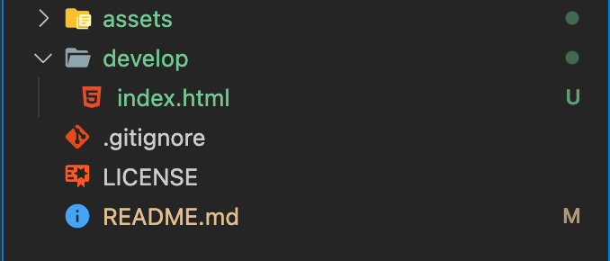

# How-to-post-to-github-pages

Here are some quick rules to help you become a pro getting our repo to be a live website, along with some common pitfalls.

## The index.html rule

Since most website have multiple html files, Github needs a way to know which of those html files is the Landing Page. Therefore...

1. We must have one file called index.html.
2. The index.html file must be in the top folder Github looks at. It will not dig through folders searching for it.
3. One indicator of a nested or missing index.html file is only seeing the Readme as your live website. Github has a rule where if it doesn't find an index.html at the top folder level, it will assume you want to post the readme instead.

This file structure will break because the html is nested in a develop folder. 

This file structure will break because there is no index.html. 

This file structure will work correctly! 

## Root Vs Docs

In class, we discussed using the Root option and just making sure your index.html is in the top folder. But if that works, why have a Docs option at all? 

The answer has to do with something the industry calls "seperation of concerns". It basically means having distinct sections for files that have different jobs. 

Github has a docs folder with the idea of putting files that directly build your website inside the docs folder, and other files outside of your docs folder. Using the Docs method doesn't change how your website works, but will make you look like a more organized developer. It's important to know that using a root or docs approach has no impact on your grade.

# A couple other common issues and Github Quirks
## absolute vs relative paths

Absolute paths will work locally, but break on github. An absolute path example is src="Users/Ethan/Desktop/project/index.html". It reads the entire file structure of my computer. Github doesn't have my computer, so it doesn't know how to read this. This is a common break for students who use the copy/paste option for paths in vs code. I would recommend against copy/pasting paths.   

To fix this, we use relative paths. This is like using "./css/styles.css". When we start with a . or a /, Github knows its relative, meaning your telling it where to look based on the current file it's looking at. 

## Capitalizations

A weird quirk with Github is that it is case sensative, but your local computer is not. make sure all file extensions like .html are lowercase. have .HTML would work locally, but break on github. 

## Github's batch loading 

When you make a change and are checking to see if it worked, know that github updates are not instance. Usually it's a couple seconds, but sometimes it is a little longer. I haven't seen longer than 2 minutes. In order to be efficient, Github waits for a certain number of people to make changes to their live websites, then uploads all those changes at once, as a batch. 

-- hope that helped : ) 

